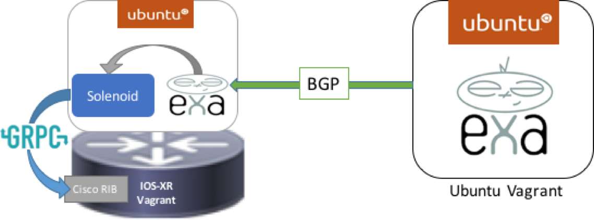

# Solenoid-Vagrant
#####Vagrant for Solenoid application demo
#####Author: Karthik Kumaravel
##### Contact: Please use the issues page to ask questions or open bugs and feature requests.

### Overview
This is a Vagrant box set up to demo the Solenoid application. This Vagrant uses two virtualbox VMs, an IOS-XRv image and an Ubuntu/trusty64 image. The plumbing and demo functions are brought up through bash scripts to allow you to use the Solenoid application without hassle, and demo it to others.



### Set Up

To install the application.

Step 1. Set up Virtualbox and Vagrant on your device

Step 2. Clone this repo

Step 3. Download the IOS-XRv vagrant box through the following link:

&nbsp;&nbsp;&nbsp;&nbsp;Download: https://xrdocs.github.io/getting-started/steps-download-iosxr-vagrant

And follow the instructions to add the base box:

&nbsp;&nbsp;&nbsp;&nbsp;Instructions: https://xrdocs.github.io/application-hosting/tutorials/iosxr-vagrant-quickstart


Step 4 (optional). The Solenoid LXC tarball is downloaded for you (see vagrant/xrv/bootstrap.sh), but you can also create your own tarball if you want use the latest code. Follow the instructions [here](https://cto-github.cisco.com/lisroach/Solenoid/wiki/Create-your-own-Solenoid-LXC-tarball).


Step 5. In a terminal screen change directory into the vagrant directory of the repository. The vagrant file is located here.<br />

    cd Solenoid/vagrant

Step 6. ```vagrant up```

This is all you need to get Solenoid working!

### How to use this demo.

After completing the initial ```vagrant up```, the application is already up and running. If you navigate to:

     localhost:57780

on your browser, you will see the routes being added and withdrawn from the IOS-XRv's RIB table. To view the application running on the box, reference the instructions below on how to navigate the vagrant environment.


### Navigating the Vagrant environment

This Vagrant environment has 4 locations:

1. IOS-XRv bash

2. IOS-XRv cli

3. Ubuntu container on IOS-XRv (running Solenoid)

4. Ubuntu devbox (running exaBGP)


This is how to access each of these components.

####XR bash
From the vagrant folder on your laptop:

    vagrant ssh xrv

XR CLI and Solenoid is accessed in from XR bash

####XR CLI
From XR Bash (see instructions above):

    ssh 10.1.1.5

password: vagrant


####Container running Solenoid
From your laptop's vagrant folder:

    ssh -p 58822 ubuntu@localhost

Password: ubuntu


To see the actual Solenoid application running, enter the following from the container (see instructions above) in order to enter the running [screen](https://www.gnu.org/software/screen/manual/screen.html):

    screen -r exabgp

To see the website running, enter the following from the container (see instructions above) in order to enter the running [screen](https://www.gnu.org/software/screen/manual/screen.html):

    screen -r website


####Ubuntu Devbox
From the vagrant folder:

    vagrant ssh devbox

From this vagrant box, to access exaBGP enter the [screen](https://www.gnu.org/software/screen/manual/screen.html) that is currently running:

    sudo screen -r

note: This will be changed to not use sudo.


